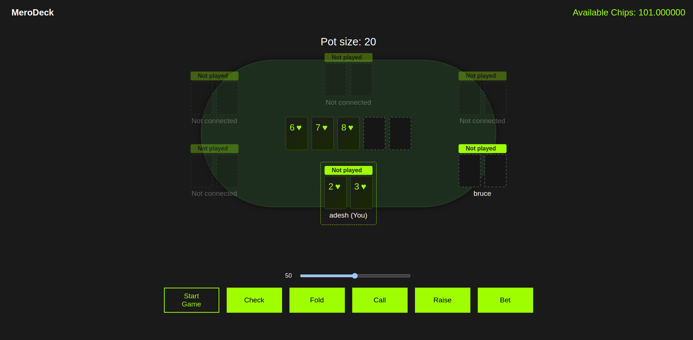
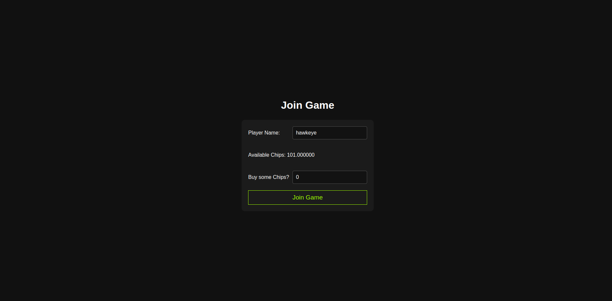

# MeroDeck

A decentralized privacy preserving poker holdem implementation on Calimero network and transaction managed on starknet with a specialized MERO token.

# Setup

## Setting up the Calimero node
The node setup procedure is simplified using bash scripts. Managing the node from scripts makes testing a lot simpler and easier.

- Setup a calimero node using
```bash
cd logic
chmod +x script.sh
./script.sh
```
- Your node will be running and you will get an output listing all of the required params, these are also saved in `node_vars.env` for easy access later.

## Frontend

- Move to app directory `cd app`
- Install all the packages using `pnpm install`
- Run the dev server `pnpm dev`
- Login using Calimero node admin dashboard and ArgentX wallet.


## Running another node and connecting to same context (for testing)

- Make sure you are in `/logic` direcrtory.
- Change the application path in the `join_another.sh` to match the path of your new built wasm.
- Use the env vars of running the first node `source node_vars.sh`
- Make executable `chmod +x join_another.sh`
- Run the script `join_another.sh`

# Gameplay

## Joining the game


- Enter a username to join the game and amount of chips currently minted using your wallet will be displayed. If they are sufficient and you do not want to buy more you can proceed with an amount of 0.

## Play Menu

- Initially the game phase is waiting so you can allow other players to joing.
- Start the game using `Start Game` button, currently any player can start the game, will be changed later to more graceful options (consensus of players).
- Each player can play their move using the four options, `CHECK, CALL, FOLD, {RAISE: amount}, {BET: amount}`, each option with their own restrictions of when what can be played.

- In summary,
    - CHECK can be done only if there is no BET or RAISE played in the round.
    - BET should be the first aggressive move of the round, cannot be played if there is an existing BET or RAISE.
    - CALL should only be played after there is an aggressive move present to match the amount of bet they have in current round.
    - A round is over if either all players folded except one (winner) or if all players checked (everyone skipped), or if all of the active players (not folded) have contributed same amount to the pot in current round.

- After each move the amount to increment is sent to the frontend from where it goes to the starknet connection which sends that much amount of money to the pot (this needs to be more robust and secure later).

- After the winner is decided the frontend sends the money from contract to winner, this is for POC and can be replaced with a cross contract call from calimero network.

